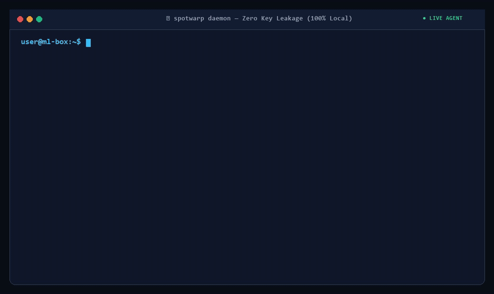

# ⚡ SpotWarp: Never Lose a Training Run to a Spot GPU Eviction

[](https://pypi.org/project/spotwarp/)
[](https://github.com/enplabs/spotwarp/releases/latest)
[](https://opensource.org/licenses/MIT)
[](https://gpu-action.com)

<div align="center">
  
</div>

The real cost of a Spot GPU eviction was never the few minutes of downtime — it's the hours of training progress that vanish with it. **SpotWarp** is a high-performance, standalone C-binary (Zero-Python required) and lightweight daemon that runs continuous automatic backups of your workspace in the background, so an eviction never costs you your work. Sub-minute cross-cloud failover (Vast.ai ⇄ RunPod) is what turns that protected workspace into a hands-off recovery, but the backup is the part that actually saves you.

Save **up to 70% on GPU compute bills** by safely using Spot pricing instead of on-demand — the eviction risk that normally makes that a gamble is exactly what SpotWarp removes.

---

## 🆚 Spot GPU Eviction: Standard vs. SpotWarp

| Feature | Standard Spot Instance | With SpotWarp (v3.4.2) |
| :--- | :--- | :--- |
| **Your Data, on Eviction** | Gone. Whatever wasn't manually saved is lost with the instance. | **Continuously backed up** in the background before the eviction ever happens — nothing to lose. |
| **Recovery Process** | Manual console log-in, search for a new GPU, manual setup. | **100% Autopilot**. Parallel candidate racing rents & verifies a replacement in under a minute. |
| **If your cloud is out of stock** | Failover fails outright — nothing to migrate to. | **Any-to-Any Cross-Cloud Bridge**. Seamless cross-cloud failover across Vast.ai and RunPod in both directions (`Vast.ai ⇄ RunPod`). |
| **Paying fallback-cloud rates forever** | N/A | **Bidirectional Auto-Failback**. Continuously checks your primary cloud and automatically repatriates the workload the moment lower-cost capacity returns. |
| **Workload Continuation** | Restart training from epoch 0. | **Auto-Resume**. Script continues running via `nohup` over SSH, from where the backup left off. |
| **Security Risk** | Requires placing S3/GitHub keys on unstable rented hosts. | **Zero Key Leakage**. All API keys remain on your local machine. |

---

## 💎 Core Commercial Features

* 🛡️ **Continuous Automatic Backup — the real safety net**: Runs high-speed `rsync`/`scp` incremental backups of your workspace to your local machine in the background, the whole time your instance is running — not just triggered after an eviction is detected. This is the feature that actually prevents loss; everything else below just makes recovering from it fast and hands-off.
* 🏁 **Parallel Candidate Racing**: On eviction, SpotWarp rents several replacement candidates concurrently instead of trying them one at a time — a single slow or dead host no longer adds minutes to your downtime. Typical failover: well under a minute.
* 🌐 **Cross-Cloud Fallback (Vast.ai ⇄ RunPod)**: If your primary cloud has zero matching candidates at the moment of eviction, SpotWarp automatically bridges to RunPod — spot pricing first, retrying on-demand if RunPod has no spot capacity for that GPU model — so your workload stays protected instead of failing outright.
* ↩️ **Automatic Cost-Optimizing Failback**: A bridge-cloud replacement is never left running indefinitely at the higher rate. SpotWarp keeps checking your original cloud in the background and migrates the workload back the instant a cheaper matching candidate reappears — verified end-to-end on a single live instance: rented on Vast.ai, evicted, bridged to RunPod, then automatically migrated back to Vast.ai once capacity returned.
* 💸 **CFO-Approved GPU Savings**: Safely exploit cheap Spot pricing on Vast.ai. SpotWarp gives you the reliability of a Dedicated On-Demand GPU for the price of a Spot instance.
* ✅ **Real Connectivity Verification**: Replacement hosts are confirmed reachable via an actual SSH handshake before they're trusted — not a proxy signal like a Jupyter API ping that can report false negatives on a perfectly healthy host.
* 🔒 **Zero-Trust Security (100% Local)**: Your cloud provider API keys (`VAST_API_KEY`, `RUNPOD_API_KEY`) stay on your local PC. Rented containers never see your cloud credentials.
* 📦 **Zero-Configuration**: No need to install daemons, cron jobs, or synchronization tools inside the remote container.
* ⚡ **Training Auto-Resumer**: Automatically restarts your training scripts (`--resume-cmd`) in the background of the new container, pointing directly to your restored, backed-up checkpoints.

---

## 🚀 Quick Start in 1 Minute

### 1. Installation (Universal 1-Liner or pip)

**Linux / macOS (1-Liner):**
```bash
curl -fsSL https://gpu-action.com/install.sh | bash
```

**Windows PowerShell (1-Liner):**
```powershell
irm https://gpu-action.com/install.ps1 | iex
```

**Standard Python pip (Any OS):**
```bash
pip install --upgrade spotwarp
```

### 2. Zero-Config Smart Sniffing or 1-Minute Setup
SpotWarp automatically detects your existing Vast.ai and RunPod keys from `~/.vast_api_key` or `~/.runpod/config.toml`. Or run the interactive setup wizard:
```bash
spotwarp init
```

### 3. Start the Guard
```bash
# Option A: Foreground Live Console
spotwarp start

# Option B: 24/7 Background Daemon (safely close your terminal)
spotwarp start -d
```

### 4. Daemon Management
```bash
spotwarp status   # Check daemon health & PID
spotwarp stop     # Gracefully stop the background daemon
spotwarp config   # View local configuration
```


---

## ⚙️ How It Works (The Warping Cycle)

```text
[Rented GPU Host]                     [Local PC (Client)]                    [New GPU Host]
  (Active Workload)
         │                                     │                                    │
         │ ─── (Sync: rsync/scp delta) ──────> │ (Cached Workspace)                 │
         │                                     │                                    │
    [🚨 Evicted!]                              │                                    │
         ❌ ─── (Detected within 5s) ────────> │                                    │
                                               │ ─── (Race 4 candidates) ──────────> │
                                               │      cheapest of the ready pool wins │
                                               │ ─── (Restore Workspace) ──────────> │
                                               │ ─── (Nohup Resume Command) ──────> [Run Workload]
                                                                                      (Continuing!)

  If Vast.ai has zero candidates:
                                               │ ─── (Bridge to RunPod) ────────────> [Temp Replacement]
                                               │ ⋯ keeps watching Vast.ai in the background ⋯
                                               │ ─── (Vast.ai capacity returns) ──> [Migrate back, cheaper]
```

1. **Eviction Detection**: SpotWarp polls the cloud API every 5 seconds. If eviction is detected, it triggers failover immediately.
2. **Parallel Candidate Racing**: SpotWarp rents up to 4 matching-GPU candidates concurrently and picks the cheapest one that proves SSH-reachable, instead of trying offers one at a time.
3. **Cross-Cloud Bridge (if needed)**: If no Vast.ai candidate exists at that moment, SpotWarp automatically rents on RunPod instead — spot pricing first, on-demand as a second attempt — so the workload is never left completely unprotected.
4. **Delta Sync Restoration**: SpotWarp transfers the cached workspace folder to the new container and confirms it's reachable over a real SSH connection.
5. **Nohup Handover**: SpotWarp connects via SSH to trigger the `--resume-cmd` in the background.
6. **Auto-Failback**: If step 3 was needed, SpotWarp keeps quietly re-checking Vast.ai for that GPU model. The moment a candidate reappears, it migrates the workload back automatically and releases the bridge-cloud host — no manual intervention, no forgotten expensive instance left running.

---

## 📄 License & Security Audits
SpotWarp is distributed under the MIT License. The code executes 100% locally in user space on your local computer, ensuring full transparency and compliance.
